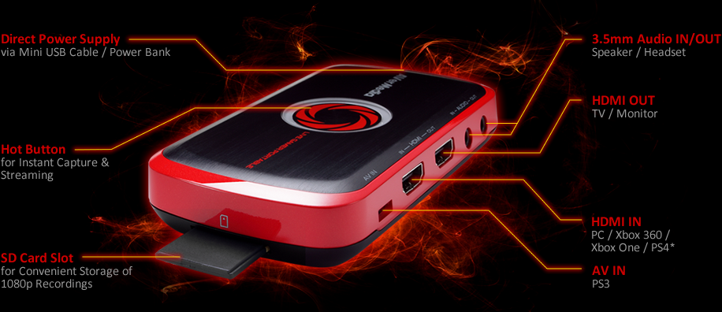
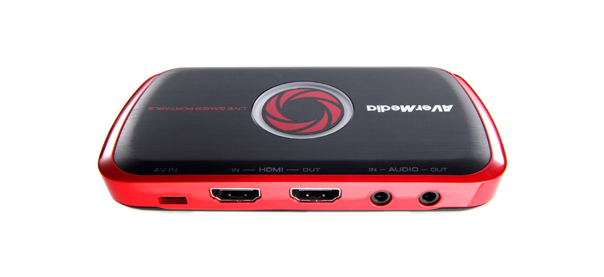
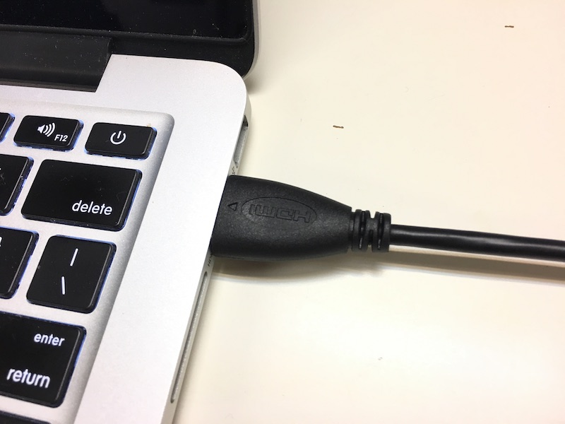
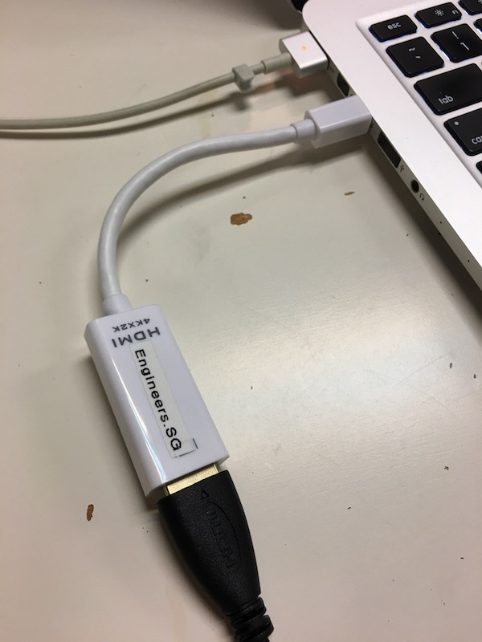
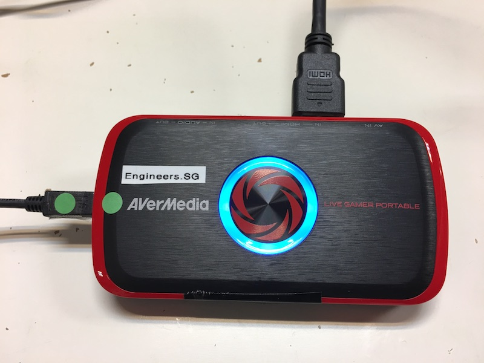
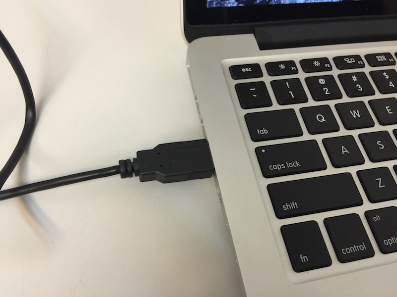
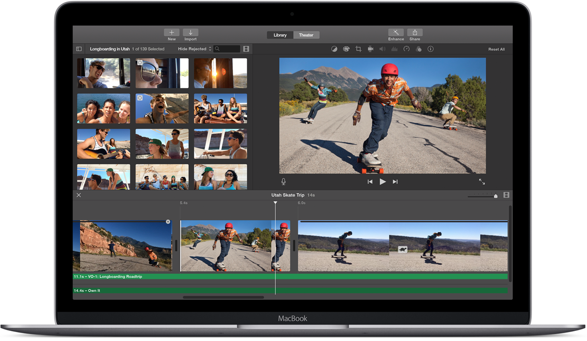

# Advanced - Camera and Screen Grabber

## Introduction

While recording the meetup videos on 1 camera captures the speaker's voice and presentation well, it does poorly in capturing the speaker's presentation screen. Although using QUickTime Player or some software screen recorder is doable - it is too invasive, and the presenter might have time to prepare them before the talk.

## Hardware Screen Grabber

So an external screen grabber is needed to intercept and record the presentation screen video before sending the video stream on to the projector. This is done with a hardware screen grabber.

One such device is the [Avermedia Live Gamer Portable](http://gamerzone.avermedia.com/gaming/product/game_capture/live_gamer_portable).

## Steps

1. Presenter's laptop should use HDMI output.

	
	
	You should use an adapter if the laptop doesn't support HDMI output:
	
	 
	Here's a Mini-Displayport to HDMI adapter.

2. HDMI signal is sent to a HDMI splitter, that sends 1 signal to the projector. Another is sent to the screen grabber.

	

3. The HDMI signal is sent to the Avermedia Live Gamer Portable.

	

5. The Avermedia Live Gamer Portable can record the video into an SD card in PC-Free mode. But from past experience, its more stable to use a PC to record that feed.

	
	
6. Record the presenter's talk using the software provided by Avermedia. Its usually a 720p @ 30FPS (frames per second) resolution.

7. Mix the screen grabber video feed with the camera video feed in post production.

8. Upload to YouTube Channel.

7. ***Profit!***

## Costs

- [Avermedia Live Gamer Portable](https://www.amazon.com/AVerMedia-Recording-Definition-Streaming-C875/dp/B00B2IZ3B0/) - SGD$219.00
- [View HD HDMI Spltter](https://www.amazon.com/ViewHD-Powered-Splitter-1080P-Model/dp/B004F9LVXC/) - SGD$50
- HDMI cables (5m x 2) - SGD$15 each

**Total:** ~SGD$299

## Post-Production

The video feed from the external camera and the screen grabber is now ready to be mixed together in post-production. We usually use [Apple iMovie](https://www.apple.com/sg/mac/imovie/) to do the post production (its free!). We would use the presentation screen as the main panel and the camera feed is set in a corner (picture-in-picture arrangement).

Here's some quick tutorials:

- Screen shot [walk through](http://computers.tutsplus.com/tutorials/how-to-create-a-movie-from-start-to-finish-with-imovie--mac-59638) on how to create a video in iMovie.
- Video: [iMovie for Beginners 2015](https://www.youtube.com/watch?v=ZGG5kbMKmLo)

You can also use [Final Cut Pro X](https://www.apple.com/sg/final-cut-pro/) or [Adobe Premiere Pro CC](http://www.adobe.com/sea/products/premiere.html) (both are paid software).

## Example Footage

