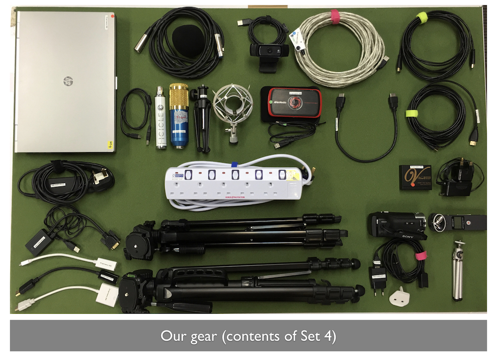
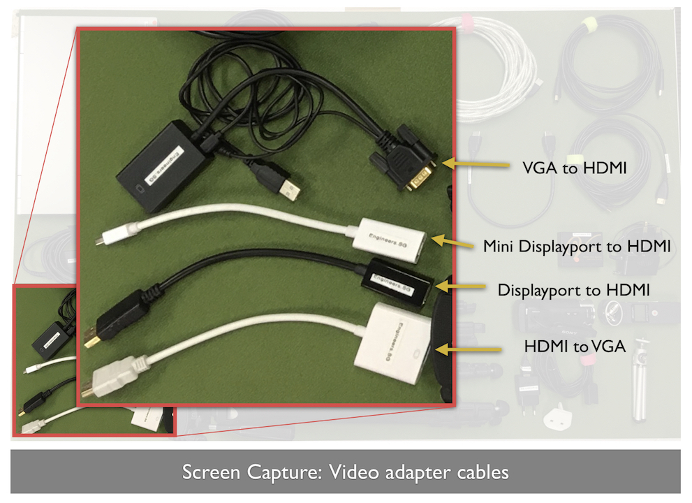
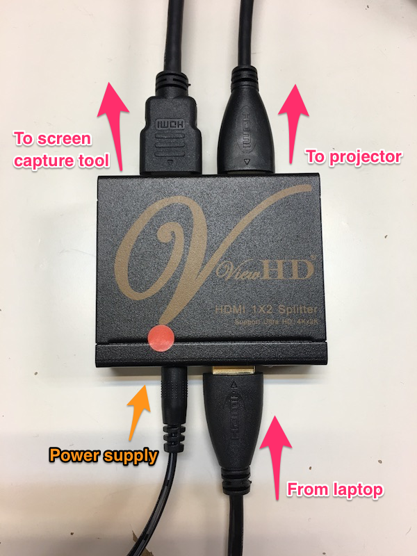
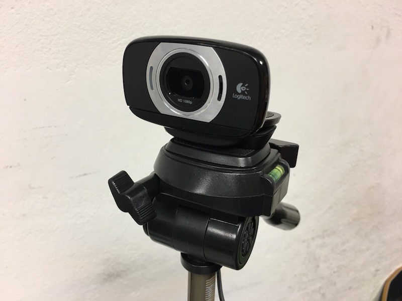
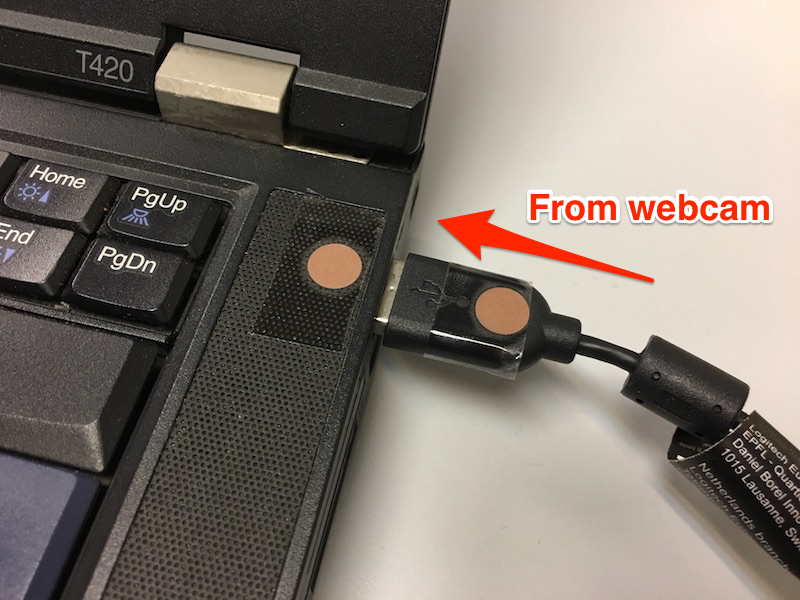
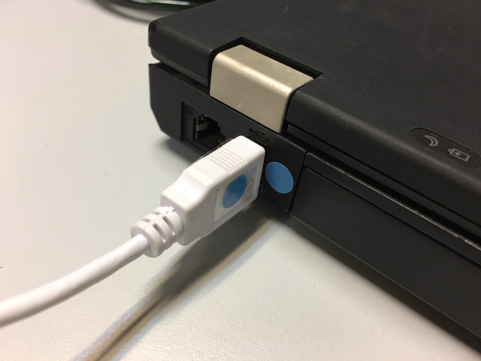

# Our Current Setup

Here's a overview of the different components of our recording system:

## Contents of our pack

## Input Sources

### Screen Capture

1. Presenter's laptop should use HDMI output.

	
	
	You should use an adapter if the laptop doesn't support HDMI output:
	
	 
	Here's a Mini-Displayport to HDMI adapter.
	
	 
	More adapters.

2. HDMI signal is sent to a HDMI splitter, that sends 1 signal to the projector. Another is sent to the screen grabber.

	

3. The HDMI signal is sent to the Avermedia Live Gamer Portable.

	

4. The Avermedia Live Gamer Portable can record the video into an SD card in PC-Free mode. But from past experience, its more stable to use a PC to record that feed.

	

### Video Recording

We use a webcam to record the speaker. Its the easiest to hook up directly to a laptop. Downside is that it doesn't have optical zoom, so you will need to move the camera closer if you want to get a closer shot of the speaker.

The webcam is mounted on a tripod.

### Voice Recording

For voice recording, we use a condenser microphone for maximum sensitivity.

 
Here's a condenser microphone on a small microphone stand. Its connected via a 3-pin audio cable (also called an XLR cable).

 
And we connect the condenser microphone to a XLR to USB sound card ([Blue Icicle](https://www.amazon.com/Blue-Icicle-XLR-Converter-Preamp/dp/B001EW5YQS)).

 
The Blue Icicle has a USB interface.

## Software

ALl the 3 input sources are connected to a laptop via USB. We use a software video mixer to integrate all these 3 sources. The output from the software video mixer is one single video file that is pre-edited. This video file is then uploaded to YouTube.

The software video mixer we use is called [OBS Studio](https://obsproject.com). This software is free and open source. And it runs on Windows, Mac and Linux.

## The Setup

Here's a short video of us setting up our recording equipment.

## Bill of Materials

Item | Cost (USD) | URL
-----|:----------:|-----
2nd hand Windows laptop Hp Elitebook 8470p Core i5 3rd Generation Laptop | $309.00 | [http://a.co/0K7tSe2](http://a.co/0K7tSe2)
Avermedia Live Gamer Portable	| $150.85	| [http://a.co/b6HAWC2](http://a.co/b6HAWC2)
Logitec C920 Webcam (video capture)	| $59.99 | [http://a.co/8weE4uj](http://a.co/b6HAWC2)
USB 2.0 extension cable (5m) | $13.95 | [http://a.co/2CsJJiS](http://a.co/2CsJJiS)
Condenser microphone | $22.99 | [http://a.co/6swXytq](http://a.co/6swXytq)
Blue Icicle XLR to USB sound card | $49.00 | [http://a.co/eMCPrFo](http://a.co/eMCPrFo)
XLR Cable | $12.59 | [http://a.co/ic6bN5a](http://a.co/ic6bN5a)
HDMI Splitter (1 input to 2 output) | $20.95 | [http://a.co/72PqUW1](http://a.co/72PqUW1)
HDMI Cable (2 x 5m) | $21.38 | [http://a.co/f9954a3](http://a.co/f9954a3)
Mini DP to HDMI | $8.69	 | [http://a.co/4bBklVp](http://a.co/4bBklVp)
Display Port to HDMI Male Female Adapter Converter | $10.99 | [http://a.co/iQPjvYu](http://a.co/iQPjvYu)
USB-C to HDMI | $13.99 | [http://a.co/hkTvHlA](http://a.co/hkTvHlA)
HDMI to VGA | $8.69 | [http://a.co/aw7xRH5](http://a.co/aw7xRH5)
VGA to HDMI | $16.99 | [http://a.co/iWyVcrN](http://a.co/iWyVcrN)
Tripod | $16.99 | [http://a.co/ibOBR4H](http://a.co/ibOBR4H)
| **Total:** | **$428.04**